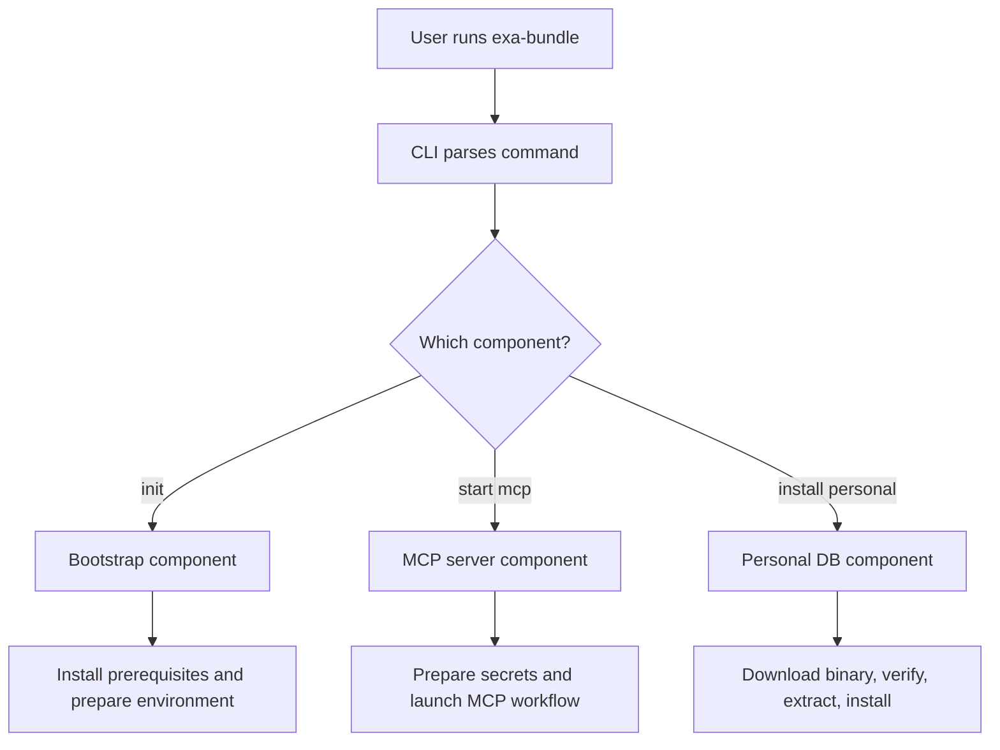
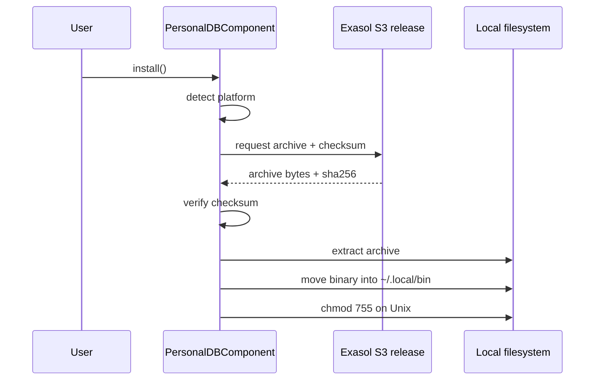
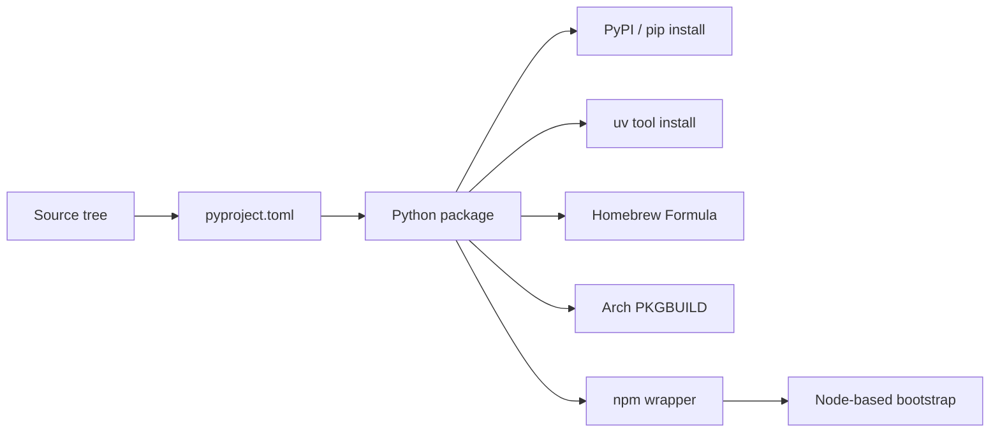
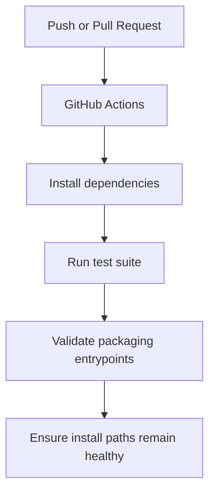

# Architecture

## High-level overview

Exasol Bundle is a thin orchestration layer for the Exasol ecosystem. Its purpose is to make local onboarding and setup predictable by exposing one command-line entrypoint, routing the request to the right component, and delegating the actual work to install scripts, package metadata, and platform-specific helpers.

The project is intentionally simple:
- the CLI entrypoint parses commands and dispatches them to components
- each component owns one responsibility, such as bootstrapping a local environment, managing the personal database binary, or preparing an MCP-server workflow
- the packaging layer exposes the CLI through Python packaging metadata so it can be installed as a tool from PyPI, Homebrew, Arch Linux, or a shell installer

## Why this project exists

The most important reason for Exasol Bundle is to remove friction. Instead of asking a user to assemble toolchains, environment variables, installers, and binary downloads manually, the project gives them one consistent experience:
- install once
- initialize the environment
- start the relevant component
- keep the local setup reproducible

## Runtime flow

## How the binary is fetched and installed

The personal database flow is the most important runtime path for local usability. The component performs the following steps:

1. Detect the current platform and architecture.
2. Build the correct download URL for that platform.
3. Download the archive into a temporary directory.
4. Fetch and validate the accompanying SHA256 checksum.
5. Extract the binary from the archive.
6. Place the binary into the local install path and set executable permissions where needed.

## How the project is bundled and distributed

The project is bundled as a Python package and exposed through multiple installation paths so users can consume it in different environments.

### Packaging layers
- `pyproject.toml` defines the package metadata, entrypoints, and package discovery.
- `install.sh` provides a shell-based bootstrap path for Linux and macOS.
- `npm-wrapper/` provides a Node wrapper for environments where npm is already available.
- Package-specific metadata is also present in the Homebrew and Arch packaging directories.

## Low-level structure

### Package layout
- `exasol_bundle/cli.py` defines the command-line interface.
- `exasol_bundle/core.py` provides the shared base class for components.
- `exasol_bundle/registry.py` registers components and exposes the dispatcher.
- `exasol_bundle/components/` contains individual component implementations.

### Components
- `json_tables.py` manages the JSON tables integration and dependency flow.
- `mcp_server.py` prepares the MCP server workflow and environment wiring.
- `personal_db.py` downloads and installs the local personal DB binary, including checksum verification and extraction.

### Supporting paths
- `install.sh` and `npm-wrapper/` provide bootstrap entrypoints for shell and Node-based installation flows.
- `tests/` captures regression, preservation, and packaging expectations for these behaviors.
- `.github/workflows/` contains CI automation for validation and packaging safety.

GitHub Actions are important here because this project has multiple installation surfaces and packaging paths. CI ensures that the CLI still starts correctly, packaging metadata stays valid, the install scripts keep working, the component logic does not regress, and changes to one delivery path do not break another. The repository uses three main workflows under `.github/workflows/`: a pull-request validation workflow that checks packaging and CLI behavior before merge, an upstream wheel build workflow that rebuilds Rust-based dependencies for multiple platforms, and a release workflow that publishes the Python package to PyPI and the npm wrapper to npm.

## Design principles

- Keep the CLI thin and easy to understand.
- Keep components focused on a single responsibility.
- Keep installation and bootstrap behavior deterministic.
- Prefer explicit checks and readable feedback over silent failures.
- Make the project usable from multiple entrypoints without changing the underlying logic.

## Summary

The most important idea is that Exasol Bundle is not just a package installer. It is a small, predictable orchestration layer that simplifies setup for users and gives maintainers a reliable way to validate packaging, bootstrap flows, and binary installation behavior through automated checks.
