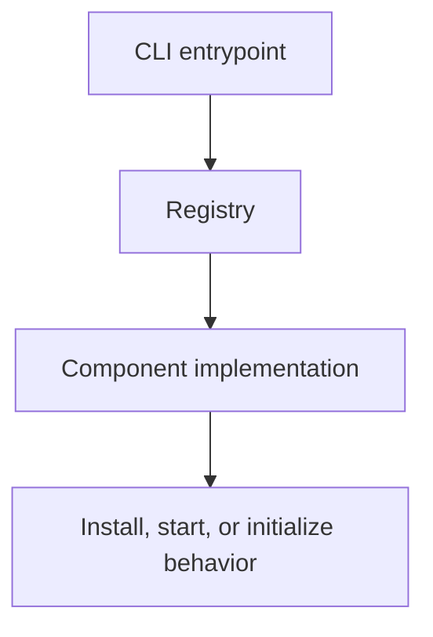

# Contributing

## Repository overview

This repository is a small orchestration layer for the Exasol ecosystem. The core idea is to keep the CLI thin, keep components focused, and make installation flows predictable.

## Project structure

- `exasol_bundle/` contains the Python package
  - `cli.py` handles argument parsing and command dispatch
  - `registry.py` registers available components
  - `core.py` provides the shared component base class
  - `components/` contains the concrete implementations
- `install.sh` provides a shell-based installer
- `npm-wrapper/` provides a Node-based bootstrap path
- `tests/` contains regression and preservation tests
- `.github/workflows/` contains CI definitions

## Development workflow

1. Clone the repository.
2. Create and activate a virtual environment.
3. Install the project in editable mode.

```bash
python3 -m venv .venv
source .venv/bin/activate
pip install -e .
```

## Running tests

Run the full suite with:

```bash
pytest -q
```

If you are changing the installer or component logic, run the relevant tests first and then the full suite.

## Architecture notes

The important execution path looks like this:



## Component responsibilities

- `personal_db` handles the personal database binary download and installation flow
- `mcp_server` handles the MCP workflow preparation
- `json_tables` handles the JSON tables integration path

## Packaging and release expectations

When changing packaging or install behavior, verify:
- the console script still points to the correct entrypoint
- the install scripts still invoke the CLI properly
- the workflow files still reflect the supported install paths

## Contribution guidelines

- Keep changes small and focused.
- Preserve the existing CLI behavior unless the change specifically requires a new flow.
- Prefer clear, user-facing messages over silent fallback behavior.
- Add or update tests for any behavior change.
- Document user-visible changes in the README or guide files.
