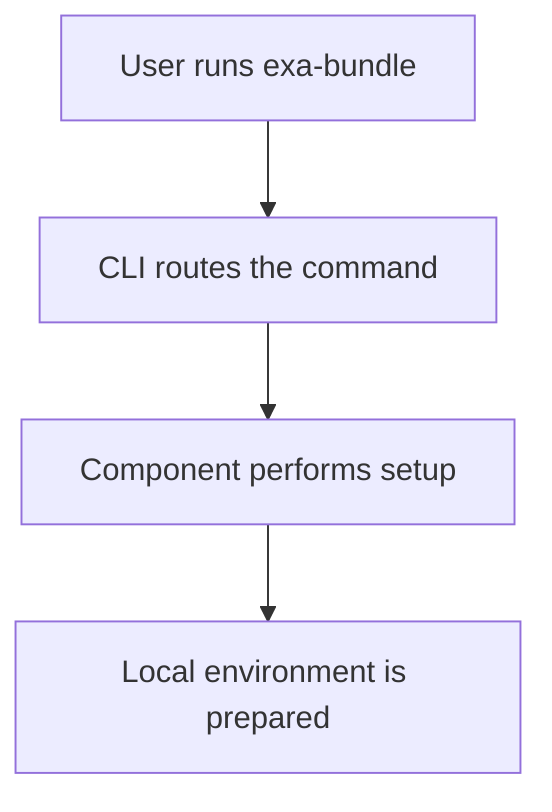

# Exasol Bundle

Exasol Bundle is a simple command-line tool for getting your local Exasol environment into a usable state. It helps you bootstrap the local setup, install the personal database binary, and prepare the MCP workflow from one consistent entrypoint.

## Quick start

### Install with uv (recommended)
```bash
uv tool install exa-bundle
exa-bundle init
```

### Install with pip
```bash
python3 -m pip install --user exasol-bundle
exa-bundle init
```

### Install with the shell installer
```bash
curl -fsSL https://raw.githubusercontent.com/your-org/exa-bundle/main/install.sh | bash
```

### Install with npm
```bash
npm install -g exasol-bundle
```

## Common commands

- `exa-bundle init` runs the initialization flow for the available components.
- `exa-bundle install personal` installs or refreshes the local personal database binary.
- `exa-bundle start mcp` prepares the MCP workflow.

## How it works



## When to use it

Use Exasol Bundle when you want a predictable setup path for:
- local Exasol tooling
- the personal database binary
- MCP-related environment preparation

## Documentation

- [USER_GUIDE.md](USER_GUIDE.md) for step-by-step end-user instructions
- [ARCHITECTURE.md](ARCHITECTURE.md) for the technical architecture and workflow design
- [CONTRIBUTING.md](CONTRIBUTING.md) for development and contribution guidance