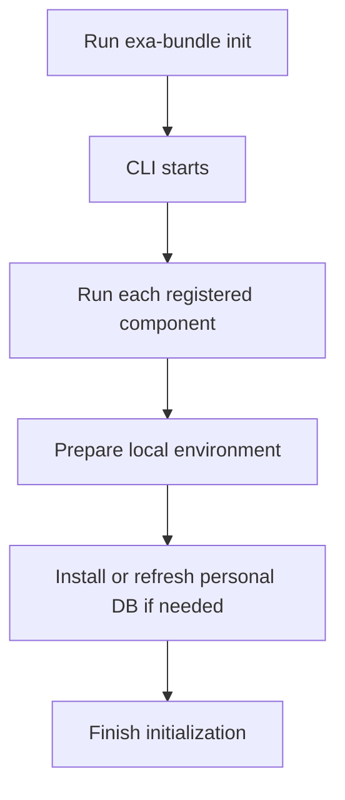

# User Guide

## What Exasol Bundle does

Exasol Bundle gives you one simple command-line tool to prepare your local Exasol environment. Instead of manually installing multiple pieces, you can run one command and let the tool handle the setup.

It is designed to help you:
- install the local Exasol personal database binary
- initialize the local environment
- prepare the MCP workflow
- keep the install path consistent across different systems

## Quick start

### Option 1: Install with uv (recommended)

If you already use Python tooling, this is the simplest choice.

```bash
uv tool install exa-bundle
exa-bundle init
```

### Option 2: Install with pip

```bash
python3 -m pip install --user exasol-bundle
exa-bundle init
```

### Option 3: Install with the shell installer

On Linux or macOS, you can use the bootstrap script.

```bash
curl -fsSL https://raw.githubusercontent.com/your-org/exa-bundle/main/install.sh | bash
```

### Option 4: Install with npm

If you already use Node.js tooling, you can use the wrapper.

```bash
npm install -g exasol-bundle
```

## What happens during initialization

When you run `exa-bundle init`, the tool goes through the registered components and runs their setup logic.



## Main commands

### Initialize everything

```bash
exa-bundle init
```

This runs all available initialization steps.

### Install the personal database binary

```bash
exa-bundle install personal
```

This downloads the appropriate binary for your platform, verifies it, and places it in your local binary directory.

### Start the MCP workflow

```bash
exa-bundle start mcp
```

This prepares the MCP integration flow.

## What to expect on different platforms

- On Linux and macOS, the installer may place the binary under your user-local bin directory.
- On Windows, the Node wrapper can help bootstrap Python first if it is missing.
- If the binary is already present, the installer will report that it is already installed and skip the download.

## Troubleshooting

### Python is missing

If the installer reports that Python is missing, install Python first and re-run the command.

### The command is not found

If `exa-bundle` is not found after installation, make sure your user-local binary directory is on your PATH.

On many Linux/macOS setups, this is:

```bash
export PATH="$HOME/.local/bin:$PATH"
```

### The personal binary install fails

If the download or checksum verification fails, check that:
- your internet connection is working
- the target platform is supported
- you have permission to write to your local install directory

## Why this tool is useful

The goal is simple: one tool, one workflow, fewer manual steps. It reduces setup friction and gives you a predictable path from installation to initialization.
